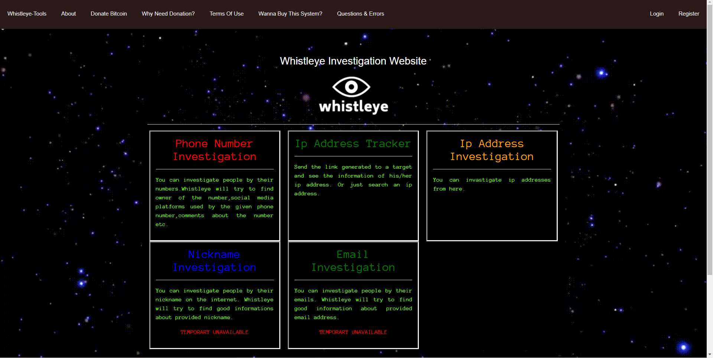

# Whistleye_Project
This project is a continuation of the Moriarty project. But this osint website, has more feautres than Moriarty has.
#  WEBSITE
* https://www.whistleye.com

If you're encountring with errors, let me know that from issues section of this repository.

# You will recieve the updates and changes from here.
* no updates yet
# Things That You Have To Pay Attention
* 1-In phone number investigation, don't forget to add your country code before typing the number. Example: 053xxx is not accepted. It has to be +9053xxx
* 2-In phone number investigation, you have to type your microsoft mail account information correctly. Otherwise, you won't get the right owner information.(you can use a fake microsoft mail it doesn't matter. Just be sure that your mail account is not used by too many people)
* 3-In ip tracker, don't forget to add the https:// statement before the rediraction link section url. Example:www.facebook.com is not accepted. It has to be https://www.facebook.com
* 4-In ip tracker, if you recieve a page like "are you lost my dear?" just refresh the page and the redirection will be success. This can be happening when you use the system first time.
* 5-In ip tracker, don't forget that all the links that you're generating, are disposable. They won't work the second time. But once someone opens it, you will be able to use the link again.
 
# Current Features:
* Phone Number Investigation
* Ip Address Tracker By Sending A Link
* Ip Address Investigation By Entering An IP Address
# Features In Development
* Advanced Email Investigation
* Advanced Nickname Investigation
* Advanced People Investigation
